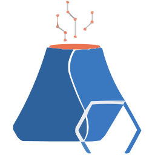

## ABOUT ME
         
I’m pursuing a Bachelor's degree in Information Technology, Networking, and IT Security (Honors) at Ontario Tech University, and I’m ranked in the top 1% on <a href="https://tryhackme.com/p/ParadoxCanDoxX" target="_blank" rel="noreferrer">TryHackMe</a>. My passion for penetration testing drives me to uncover vulnerabilities and enhance security measures. My journey began at age 12 when I started exploring and fixing vulnerabilities on my home network, which ignited my curiosity and solidified my expertise in cybersecurity. Alongside technology, I have a keen interest in business, geopolitics, and world history, which enriches my understanding of global trends and decision-making, providing a well-rounded approach to tackling both technical and strategic challenges.

<!--For the typing text here is the code for green color: 33FF00FF, please leave blank for a light blue color-

**Want to know more about me? Click <a href="https://purvapatel4725.github.io/purvapatel/" target="_blank" rel="noreferrer">HERE</a>.** 

## SOCIALS

 

## CORE COMPETENCIES

### Databases:

| MySQL | MongoDB |
|----------|----------|
| ||

### Log & Network Analytics Tools:

| Kibana | Snort |  Wireshark | Splunk | Brim |
|----------|----------|----------|----------|----------|
| | |  | ||

### Programming & Markup Languages:
| Python | Bash | JS | HTML | YAML | Markdown | CSS |
|----------|----------|----------|----------|----------|----------|----------|
|   |   |   | | |  |  |

### AI Tools:
| ChatGPT | Gemini | Llama | Copilot | Midjourney | DALL-E |
|----------|----------|----------|----------|----------|----------|
|   |   |   |  |  |  |

### OS:

| Linux | Windows | MacOS | Unix |
|----------|----------|----------|----------|
|      |  |  |  |

### Framework & Libraries:

| Tensorflow | Numpy | Pandas | Sklearn| Flask| Django | Bootstrap |
|----------|----------|----------|----------|----------|----------|----------|
|  |  |  | | |   |  | 

### Data Handling & Visualization Technologies:

| Anaconda | Jupyter | Matplotlib | Plotly | Colab | Seaborn |
|----------|----------|----------|----------|----------|----------|
||| ||| |

### Development, Testing, & Utilities:

| nodejs | Git | Docker | Postman | Kubernetes | VS Code | Netlify | GitHub | Pycharm |
|----------|----------|----------|----------|----------|----------|----------|----------|----------|
|||| ||  |  |  |  |

### Other Tools:
 
| Metasploit | Burpsuite | Netcat | Nmap | Nano | Vim | AutoHotKey | Zap |
|----------|----------|----------|----------|----------|----------|----------|----------|
|||||||| |

---

  

---

  

  

---

  

---

  

---

  ❝ <strong>What you are is the result of what you have been. What you'll become is determined by what you do now.</strong> ❞

---

  

